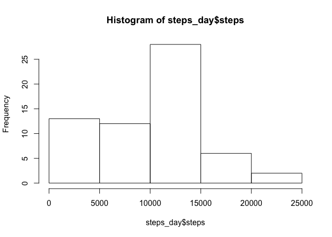
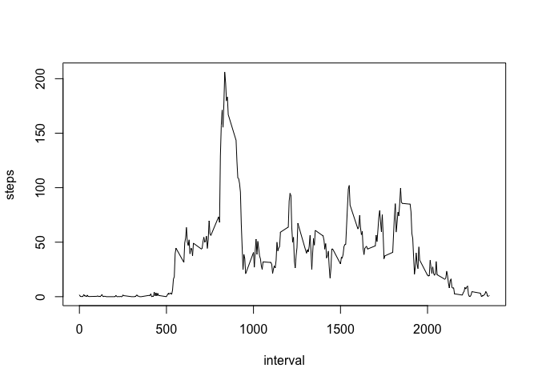
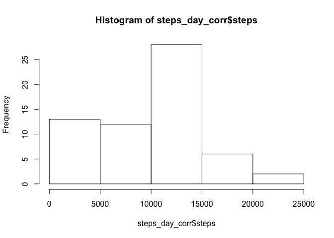
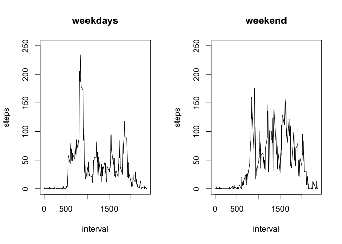

```r
library("dplyr")
```

```
## 
## Attaching package: 'dplyr'
```

```
## The following objects are masked from 'package:stats':
## 
##     filter, lag
```

```
## The following objects are masked from 'package:base':
## 
##     intersect, setdiff, setequal, union
```

## Loading and preprocessing the data

First we will unzip the file, read the raw date and process it so that:
- The column have the corresponding headers as in the raw file
- The missing value are indicated as NA in the raw data
- The date is converted to a POSIXlt format


```r
unzip("activity.zip")
df <- read.csv("activity.csv",stringsAsFactors = FALSE,header = TRUE,na.strings = "NA")
df$date <- as.POSIXct(strptime(df$date,format = "%Y-%m-%d"))
```

```
## Warning in strptime(df$date, format = "%Y-%m-%d"): unknown timezone
## 'default/Europe/Berlin'
```

```r
str(df)
```

```
## 'data.frame':	17568 obs. of  3 variables:
##  $ steps   : int  NA NA NA NA NA NA NA NA NA NA ...
##  $ date    : POSIXct, format: "2012-10-01" "2012-10-01" ...
##  $ interval: int  0 5 10 15 20 25 30 35 40 45 ...
```

```r
names(df)
```

```
## [1] "steps"    "date"     "interval"
```

## What is mean total number of steps taken per day?

We will create a dataframe with the number of steps for each day, plot the histogram and calculate the mean and the median.


```r
steps_day <- df %>%
        group_by(date) %>%
        summarise(steps = sum(steps,na.rm = TRUE))
names(steps_day) <- c("day","steps")
head(steps_day)
```

```
## # A tibble: 6 <U+00D7> 2
##          day steps
##       <dttm> <int>
## 1 2012-10-01     0
## 2 2012-10-02   126
## 3 2012-10-03 11352
## 4 2012-10-04 12116
## 5 2012-10-05 13294
## 6 2012-10-06 15420
```

```r
mean_steps_day <- mean(steps_day$steps)
median_steps_day <- median(steps_day$steps)
hist(steps_day$steps)
```

<!-- -->

So the mean is 9354.2295082and the median is 10395

## What is the average daily activity pattern?


```r
steps_interval <- df %>%
        group_by(interval) %>%
        summarise(steps =mean(steps,na.rm = TRUE))
names(steps_interval) <- c("interval","steps")
head(steps_interval)
```

```
## # A tibble: 6 <U+00D7> 2
##   interval     steps
##      <int>     <dbl>
## 1        0 1.7169811
## 2        5 0.3396226
## 3       10 0.1320755
## 4       15 0.1509434
## 5       20 0.0754717
## 6       25 2.0943396
```

```r
plot(steps_interval,type = "l")
```

<!-- -->

```r
str(steps_interval)
```

```
## Classes 'tbl_df', 'tbl' and 'data.frame':	288 obs. of  2 variables:
##  $ interval: int  0 5 10 15 20 25 30 35 40 45 ...
##  $ steps   : num  1.717 0.3396 0.1321 0.1509 0.0755 ...
```

```r
max_interval <- steps_interval[which.max(unlist(steps_interval[,"steps"])),"interval"]
```

The interval with the maximum number of step is 835, which makes sense when looking at the graph above.

## Imputing missing values


```r
number_na <- sum(is.na(df$steps))
```

The total number of missing values in the dataset is 2304.
Now we will replace the missing values with calculated one, thanks to the simple rule of replacing the value with the average of the day.


```r
i <- 1
df_corr <- df
for (s in df_corr$steps) {
        if (is.na(s)) {
                index <- which(steps_day$day == df_corr$date[i])
                df_corr$steps[i] <- unlist(steps_day[index,"steps"])
        }
        i <- i + 1
}

str(df_corr)
```

```
## 'data.frame':	17568 obs. of  3 variables:
##  $ steps   : int  0 0 0 0 0 0 0 0 0 0 ...
##  $ date    : POSIXct, format: "2012-10-01" "2012-10-01" ...
##  $ interval: int  0 5 10 15 20 25 30 35 40 45 ...
```

```r
steps_day_corr <- df_corr %>%
        group_by(date) %>%
        summarise(steps = sum(steps))

names(steps_day_corr) <- c("day","steps")
mean_steps_day_corr <- mean(steps_day_corr$steps)
median_steps_day_corr <- median(steps_day_corr$steps)
hist(steps_day_corr$steps)
```

<!-- -->

The mean of the corrected dataset is 9354.2295082 and the median is 10395. The substitution of the missing values has no significant impact.

## Are there differences in activity patterns between weekdays and weekends?

We will add a new column by using again the package dplyr and especially the function mutate.


```r
wdays <- c('Monday', 'Tuesday', 'Wednesday', 'Thursday', 'Friday')
df_wd <- mutate(df, wday = factor((weekdays(df$date) %in% wdays),
                                  levels=c(FALSE,TRUE),
                                  labels=c("weekend","weekday")))

steps_interval_weekdays <- df_wd[which(df_wd$wday=="weekday"),] %>%
        group_by(interval) %>%
        summarise(steps = mean(steps,na.rm = TRUE))

steps_interval_weekend <- df_wd[which(df_wd$wday=="weekend"),] %>%
        group_by(interval) %>%
        summarise(steps = mean(steps,na.rm = TRUE))

par(mfrow=c(1,2))
plot(steps_interval_weekdays,type = "l",main="weekdays",ylim=c(0,250))
plot(steps_interval_weekend,type = "l",main="weekend",ylim=c(0,250))
```

<!-- -->

We can see a different activity profile during the weekend, with not such a peak in the morning and more activity during the rest of day.

